# Recess

**Recess is a private leave tracker, vacation planner, sick leave tracker, and use-or-lose calculator built for people who want to plan time off without wrestling with spreadsheets or handing personal data to a random website.**

It was built with US federal leave rules as the reference implementation, but the goal is broader than that: make leave planning simple, understandable, and private.

---

## Table of Contents

- [Getting Started](#getting-started)
- [The Setup Wizard](#the-setup-wizard)
- [Pages at a Glance](#pages-at-a-glance)
- [How-To Guide](#how-to-guide)
- [FAQ](#faq)
- [Why I Built This](#why-i-built-this)
- [Privacy](#private-by-design)
- [Tech](#tech)

---

## Getting Started

Recess runs entirely in your browser — no account, no install, no server. Open the app and the setup wizard will walk you through a one-time configuration. It takes about two minutes.

If you have already used Recess on another device and exported a backup, you can skip the wizard entirely by choosing **Restore from backup instead** at the top of the first step.

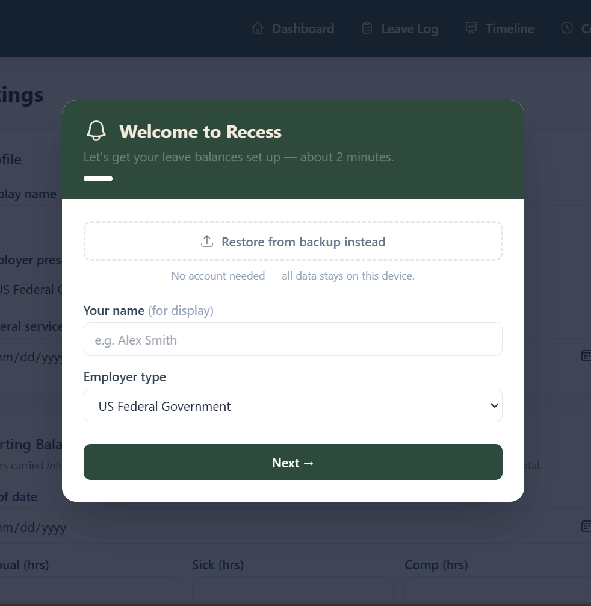

---

## The Setup Wizard

### Step 1 — Who are you?

Enter your display name and choose your employer type:

- **US Federal Government** — Recess knows the federal accrual tiers (4 / 6 / 8 hours per pay period based on years of service) and will calculate them automatically from your service start date.
- **Other / Custom** — You enter fixed accrual rates for annual and sick leave in hours per pay period.

If you have a backup file from a previous device, click **Restore from backup instead** to skip all remaining steps.

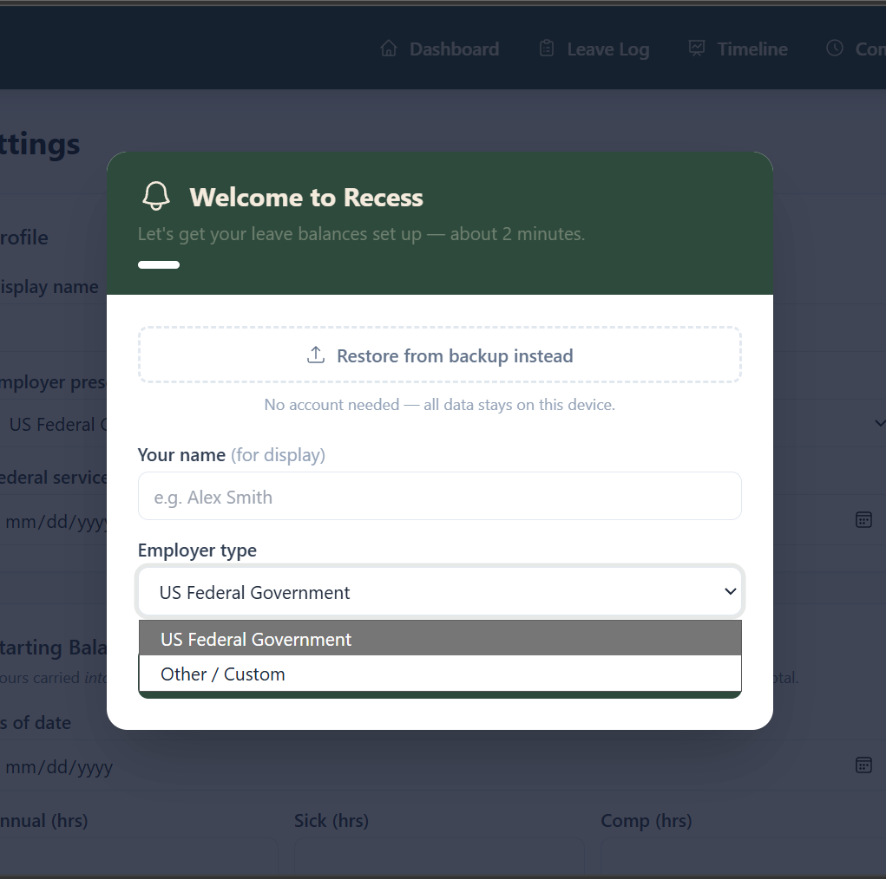

---

### Step 2 — Leave Accrual

**Federal employees:** Enter your federal service start (inception) date. Recess uses this to determine your accrual tier and will automatically handle mid-year tier changes when you cross a service anniversary.

| Years of service | Annual leave accrual |
|---|---|
| Less than 3 years | 4 hours per pay period |
| 3 to 15 years | 6 hours per pay period |
| 15+ years | 8 hours per pay period |

Sick leave always accrues at 4 hours per pay period regardless of tenure.

**Custom employers:** Enter the fixed number of hours per pay period for annual leave and sick leave. You can also set the maximum annual leave carryover cap (use-or-lose limit). Leave the cap blank if your employer has no limit.

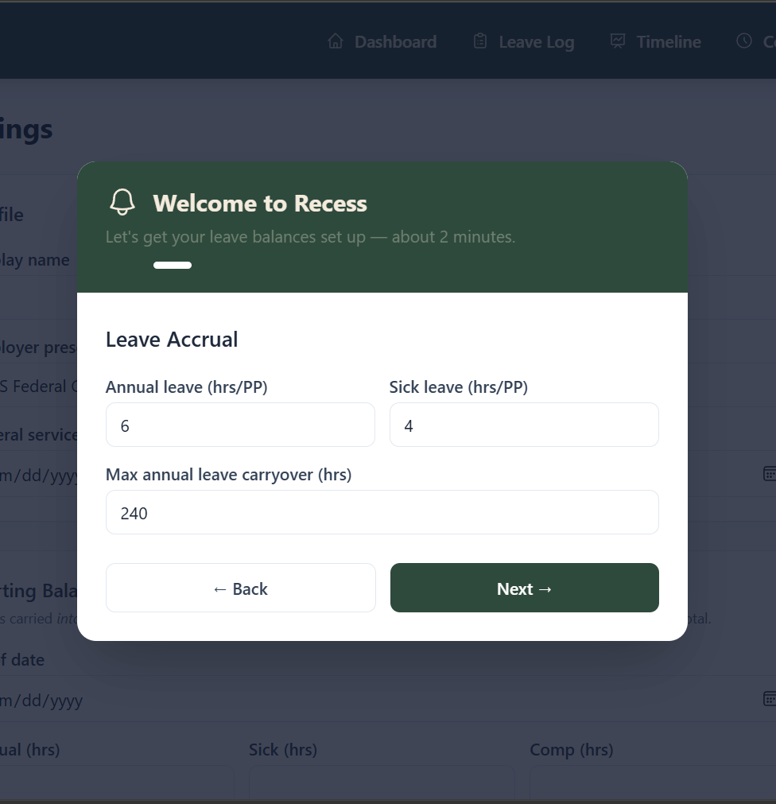

---

### Step 3 — Starting Balances

This is the most important step to get right. You are entering the balance you carried **into** a specific pay period — not the post-accrual total that appears at the end of a period.

**How to read your leave statement:**

1. Find your most recent leave and earnings statement (LES or equivalent).
2. Note the **beginning balance** for annual leave, sick leave, and comp time — these are the hours you had at the **start** of that pay period, before that period's accrual was added.
3. Set the **As of date** to the **first day of that pay period**.

> ⚠️ Using the wrong date or the post-accrual balance will shift all future projections by one pay period of accrual. When in doubt, use the beginning balance and the start date of the pay period.

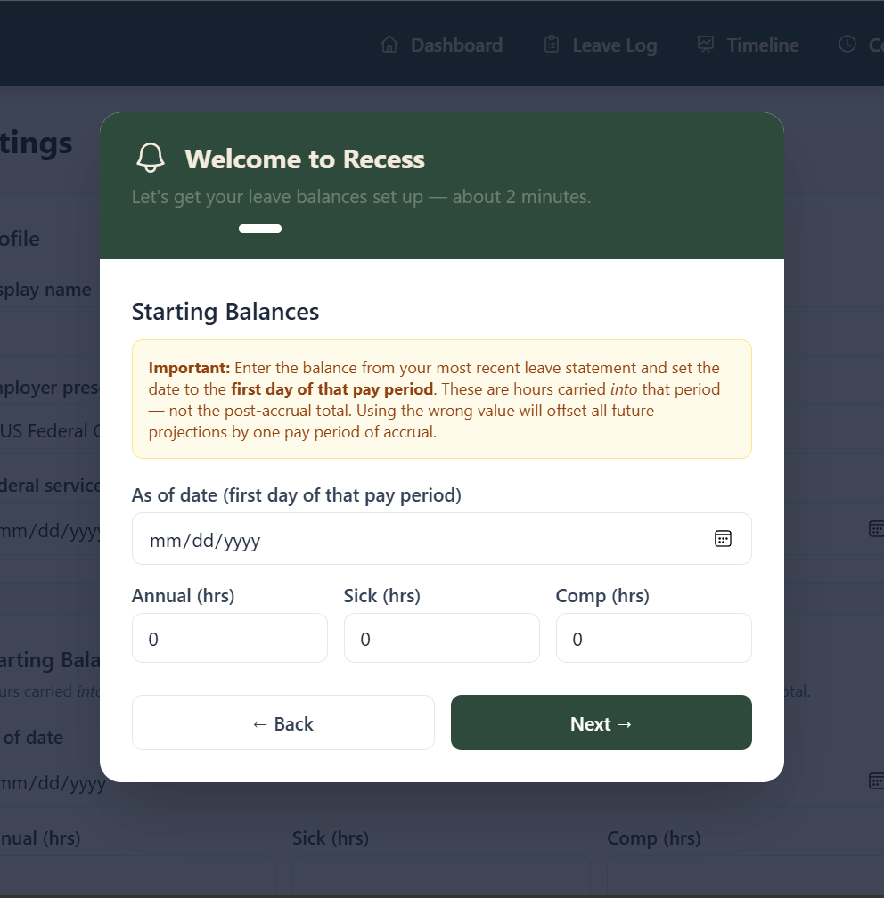

---

### Step 4 — Pay Schedule

Choose your pay frequency and enter an **anchor date** — any date that you know is the first day of a pay period. Recess derives all past and future pay periods from this single reference point.

**Supported frequencies:**

- Biweekly (every two weeks) — most common for federal employees
- Semi-monthly (1st and 15th)
- Weekly
- Monthly

A preview of your next three upcoming pay period start dates is shown so you can confirm the schedule looks right before finishing.

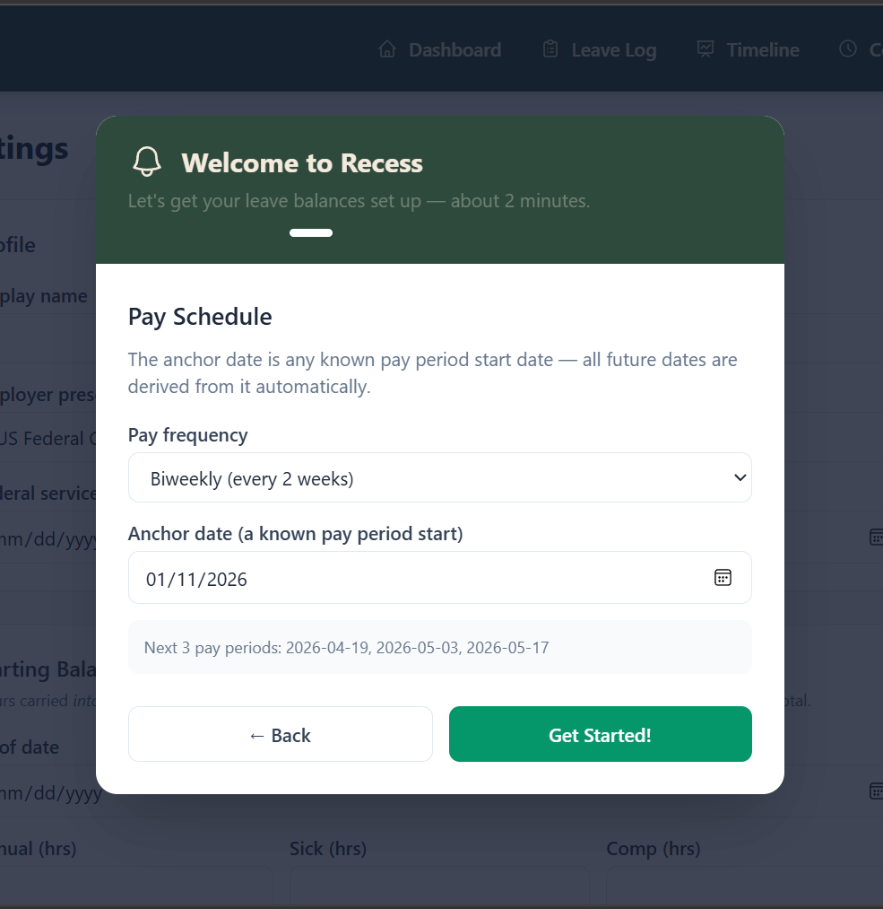

---

After finishing the wizard you land on the **Dashboard**, where your current balances and projections are immediately visible.

---

## Pages at a Glance

### Dashboard

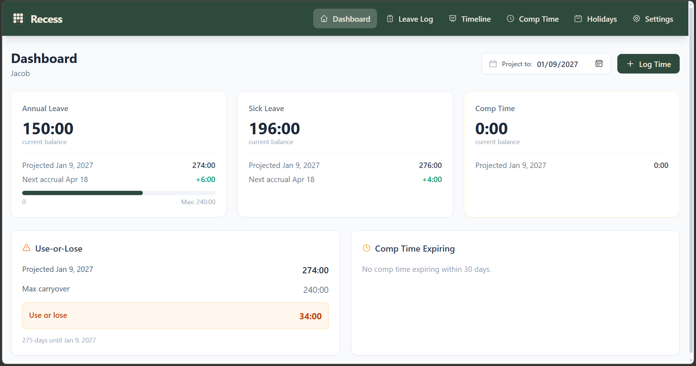

The dashboard is your home base. It shows:

- **Balance cards** — Current balance and projected balance at a target date for annual leave, sick leave, and comp time. The projection date defaults to the next use-or-lose boundary (typically year-end) and can be adjusted.
- **Next accrual** — The date and amount of your next accrual is shown on each card.
- **Use-or-Lose** — If your projected annual leave balance will exceed your carryover cap at year-end, this panel shows exactly how many hours are at risk. This projection accounts for leave you have already planned.
- **Comp Time Expiring** — Any comp blocks expiring within your warning window (default 30 days) are listed here with their expiry date and remaining hours.
- **Log Leave button** — Opens the quick-entry form to log leave taken or award/adjust a balance.

---

### Leave Log

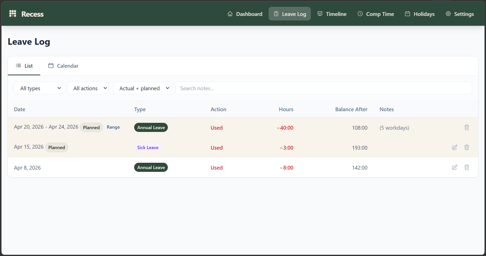

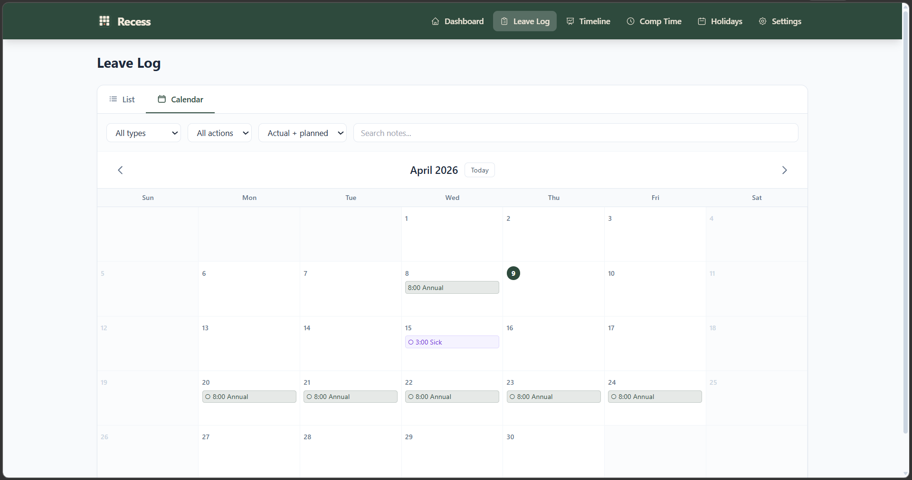

The leave log is a complete history of all your leave transactions. You can switch between **List** and **Calendar** views using the tabs at the top.

**List view** shows entries sorted newest first with columns for date, type, action, hours, running balance after the entry, and notes. Range entries (multi-day blocks) are collapsed into a single row showing the date span and total hours.

**Calendar view** shows the current month with color-coded pills on each day that has a leave entry. Use the arrow buttons to navigate months and the **Today** button to return to the current month.

**Filters** — Both views respect the filter bar: filter by leave type, action type (used / awarded), actual vs. planned, or search by notes text.

**Editing** — Click the pencil icon on any single entry to correct the date, hours, type, or notes. Range entries can only be deleted as a whole and re-entered if a correction is needed.

---

### Timeline

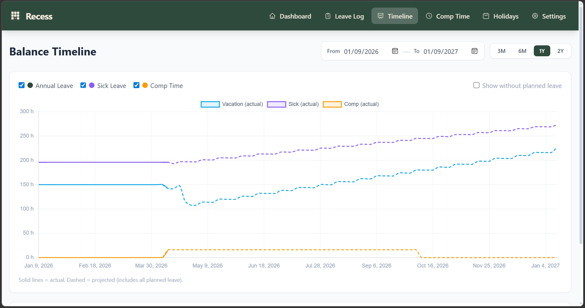

The Timeline shows a chart of your leave balances over time — past and projected — for all three leave types. Use this to visualize the impact of planned leave on your balances across a date range.

---

### Comp Time

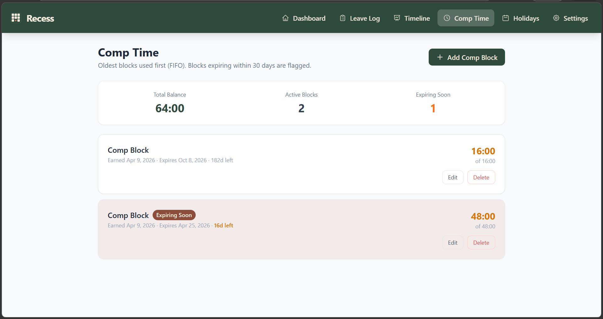

Comp time is tracked as individual **blocks** rather than a single running total. Each block has:

- A label (optional, e.g. "Weekend project")
- Date earned
- Original hours
- Expiry date (optional)

Blocks with an expiry date within your warning window are flagged **Expiring Soon**. Expired blocks are shown separately below a toggle.

To add comp time, use the **Add Comp Block** button on this page — not the dashboard. The comp page is the correct place because it captures the expiry date, which the dashboard form does not.

---

### Holidays

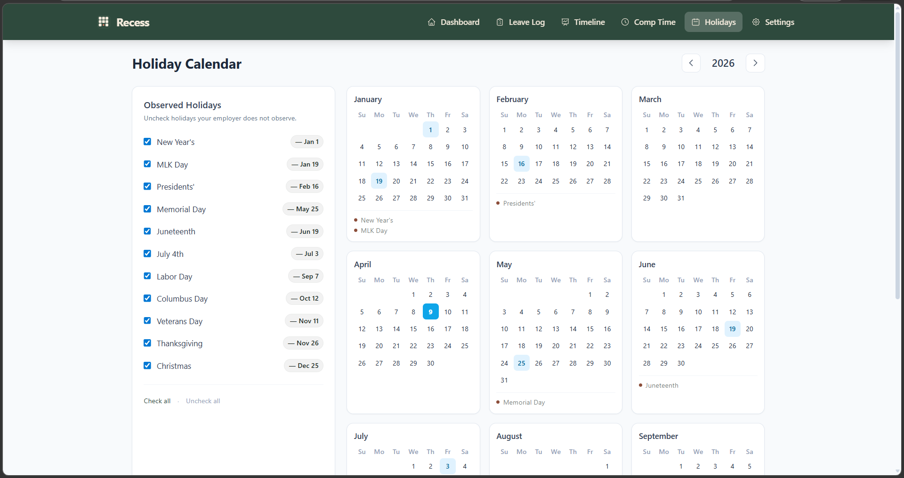

Recess uses holiday data when expanding date ranges into individual daily entries (e.g. logging a week of annual leave skips holidays automatically). The Holidays page lets you check or uncheck which federal holidays your employer observes.

---

### Settings

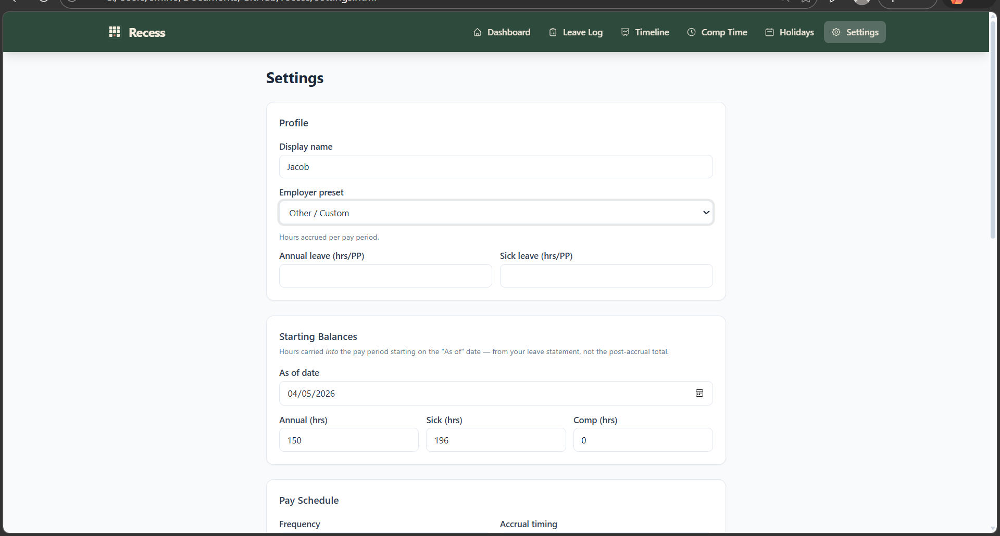

Settings lets you adjust everything you configured in the wizard, plus additional options:

- **Profile** — Display name, employer preset, service start date (federal) or accrual rates (custom).
- **Starting Balances** — Adjust the as-of date and beginning balances if you made an error during setup.
- **Pay Schedule** — Frequency, anchor date, and accrual timing (start vs. end of pay period).
- **Display Preferences** — Switch between hours and days display, and set hours per workday (useful for 4/10 or other compressed schedules).
- **Use-or-Lose** — Set the carryover cap for annual and sick leave, and the comp time expiration warning window in days.
- **Federal Holidays** — Check or uncheck observed holidays.
- **Data** — Export your data as a JSON backup, import a backup, or reset all data.

---

## How-To Guide

### Log leave taken

1. Click **Log Leave** on the dashboard.
2. Select the leave type (Annual Leave, Sick Leave, or Comp Time).
3. Enter the start date. For a single day, leave the end date blank. For a range, fill in the end date — Recess will create one entry per workday, skipping weekends and holidays automatically.
4. Enter hours (defaults to your workday length).
5. Add an optional note and click **Save**.

Future-dated entries are automatically marked as **Planned**. They count against your projected balance but are clearly flagged in the log.

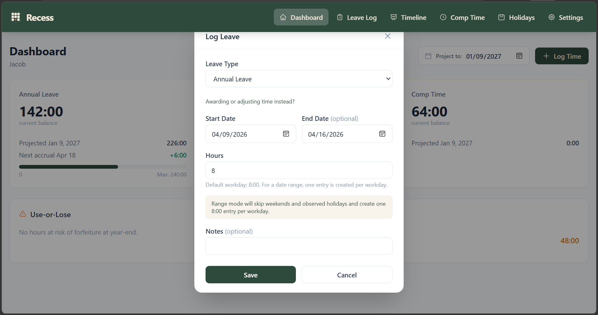

---

### Award or adjust a balance

Use this to record a manual balance correction — for example, if HR granted extra hours or corrected an error.

1. Click **Log Leave** on the dashboard.
2. Click **Awarding or adjusting time instead?** below the leave type selector.
3. Change the entry type to **Credit awarded**.
4. Enter the hours. The date is automatically set to today.
5. Click **Save**.

> ⚠️ Do not use this for comp time — comp blocks must be added from the **Comp Time** page so the expiry date can be recorded.

---

### Add comp time earned

1. Go to **Comp Time** in the navigation.
2. Click **Add Comp Block**.
3. Enter a label (optional but helpful), the date earned, the hours, and the expiry date.
4. Click **Save**.

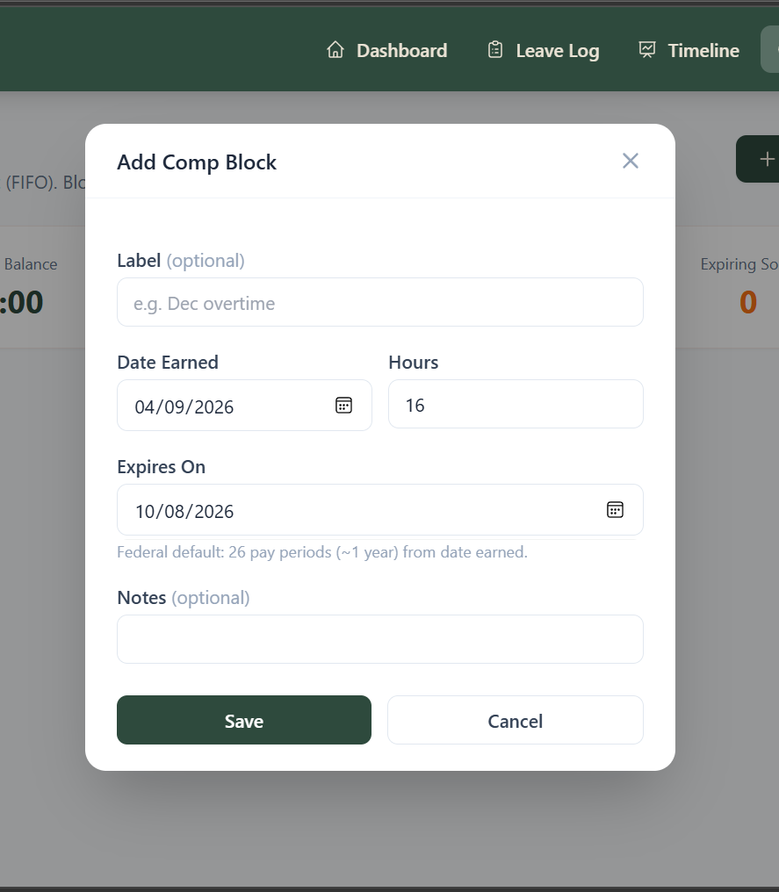

The block will appear in your comp balance immediately. If it expires within your warning window it will be flagged on both the Comp page and the Dashboard.

---

### Plan a vacation and check the impact

1. Log the vacation dates using **Log Leave** on the dashboard, using a date range for multi-day trips. These are automatically treated as planned.
2. Return to the **Dashboard** and check the projected balance on the Annual Leave card — this projection includes your planned leave and all future accruals.
3. Check the **Use-or-Lose** panel to see if the planned leave changes your year-end risk.
4. Open the **Timeline** to see the balance curve across the year.

---

### Transfer to a new device or browser

1. On your current device, go to **Settings → Data → Export JSON**. Save the file somewhere accessible (email it to yourself, save to cloud storage, etc.).
2. Open Recess on the new device. The setup wizard will appear.
3. Click **Restore from backup instead** at the top of Step 1.
4. Select the exported JSON file.

Your full history, balances, comp blocks, and settings will be restored instantly.

---

### Correct a leave entry

Find the entry in the **Leave Log**, click the pencil icon, and update the date, hours, type, action, or notes. Click **Save**.

> ⚠️ If the entry is part of a range (e.g. a week of annual leave), it cannot be edited individually — the range must be deleted and re-entered. Deleting a range removes all daily entries in that block at once.

---

### Change your pay schedule

Go to **Settings**, update the frequency and/or anchor date in the **Pay Schedule** section, and click **Save Settings**. All future projections recalculate immediately.

---

### Switch from federal to custom (or vice versa)

Go to **Settings**, change the **Employer preset** dropdown, fill in the appropriate fields (service start date for federal, or accrual rates for custom), and click **Save Settings**.

---

## FAQ

**What is the "as of" date?**

It is the first day of the pay period whose beginning balance you entered. Think of it as "these are the hours I walked into this pay period with." Recess adds accruals from that point forward. Using the end-of-period post-accrual balance with a start-of-period date (or vice versa) will skew all projections by one pay period.

---

**Why does my projected balance look wrong?**

The most common causes:

1. The starting balance was entered as the post-accrual total instead of the beginning balance. Go to **Settings → Starting Balances** and correct it.
2. The as-of date is off by one pay period. Check that it matches the first day of the pay period on your leave statement.
3. The pay period anchor date is wrong. Verify the pay period preview on the Settings page matches your actual schedule.

---

**Why is my annual leave accrual rate wrong?**

For federal employees, Recess calculates your tier from your service inception date. Check that the date in **Settings → Federal service start date** is correct. Recess handles mid-year tier changes automatically — if you cross a service anniversary during the year, the rate updates at the correct pay period.

---

**What counts as "planned" leave?**

Any leave entry with a date in the future is treated as planned. It counts against your projected balance (and use-or-lose calculation) but is visually marked as planned in the leave log. When the date passes, it automatically becomes an actual entry — no action needed.

---

**Can I log sick leave in advance?**

Yes. Enter a future date and it will be treated as planned sick leave. This is useful when scheduling procedures or anticipated recovery time.

---

**What happens when comp time expires?**

If a comp block has an expiry date and that date passes, the hours are automatically removed from your comp balance in projections. Recess warns you in advance via the **Comp Time Expiring** panel on the dashboard (default warning: 30 days). You can adjust the warning window in **Settings → Use-or-Lose**.

---

**My comp block shows 0 hours. Why?**

Comp blocks added from the Comp Time page contribute to your balance from the date they were earned. If you just added a block and your starting comp balance was 0, the dashboard should now reflect the new hours. If it still shows 0, check that the **date earned** on the block is after your **as-of date** in Starting Balances — blocks earned before the as-of date are assumed to already be included in your starting balance.

---

**Can I use Recess on multiple devices?**

Yes, using the export/import flow. Export a JSON backup from any device and import it on another. There is no real-time sync — whichever device you last imported on is the current source of truth. Get in the habit of exporting after significant changes.

---

**What if I want to start over?**

Go to **Settings → Data → Reset All Data**. This permanently deletes everything in local storage and restarts the setup wizard. There is no undo, so export a backup first if you might want to recover your data.

---

**Does Recess track FMLA, parental leave, or unpaid leave?**

Not explicitly. You can log those absences as a leave type (e.g. annual or sick) if they consume a leave balance, or skip logging them if they do not affect your balances. Recess does not have a dedicated FMLA category.

---

**What if my employer has a different use-or-lose boundary than December 31?**

Go to **Settings → Use-or-Lose** and the boundary date is configurable. Federal employees use the leave year end (typically the last day of the last full pay period in December), which Recess handles automatically when the federal preset is selected.

---

## Why I Built This

I built Recess because I got tired of trying to plan vacation and sick leave with a pile of spreadsheets that were hard to trust and even harder to use.

There are a lot of leave tracking spreadsheets online. Excel is a great tool, but most of the templates I found had the same problems:

- they expected you to enter a lot of numbers without clearly explaining what those numbers meant
- they made you repeat the same accrual data over and over
- they made it too easy to miscount future balances
- they often did not handle real planning questions very well

I did not want to:

- enter annual and sick leave accruals 26 times for every pay period
- manually figure out which pay period I move from 4 hours of annual leave to 6
- guess whether a future leave request would push me negative
- calculate use or lose by hand while also trying to account for leave I already planned
- forget that I still accrue leave while I am out on vacation and accidentally cut a trip short
- discover later that I left leave on the table because my spreadsheet math was off

I also got frustrated with systems like WebTA showing a use-or-lose number that did not reflect the leave I was actually planning to take. That is one of the most important questions a leave tool should answer:

**If I take this trip, what will my balance actually be by the end of the year?**

That seems simple, but it gets surprisingly messy when you also have to account for future accruals, planned vacation, scheduled sick leave, comp time, use-or-lose boundaries, and negative balance risk.

Recess exists to answer those questions clearly.

---

## Private by Design

Recess is intentionally lightweight and private.

- no backend
- no account
- no analytics
- no telemetry
- no server storing your leave data
- no requirement to give your email address to yet another site

Your data stays in your browser unless you explicitly export it. The source of truth is a JSON file you can save and re-import on any device.

That privacy model is a feature, not an afterthought.

---

## Tech

- Vanilla HTML, CSS, and JavaScript
- Tailwind CSS (CDN)
- localStorage for persistence
- JSON import/export for durable, user-controlled backups
- Static hosting via GitHub Pages
